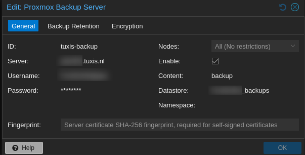
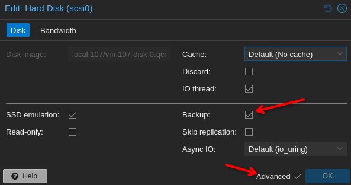

# 🖥️ Migrar VM entre Proxmox usando Proxmox Backup Server (PBS) ☁️

¿Tienes un cluster de Proxmox y necesitas mover una VM de un nodo a otro? Usando **Proxmox Backup Server (PBS)** como intermediario tienes la solución más limpia, rápida y segura. En este artículo te explico cómo hacerlo usando **Tuxis** como servicio de PBS en la nube 🌩️

<!-- more -->

---

## 🧠 ¿Por qué PBS para migrar?

| Método | ⚡ Velocidad | 🔒 Seguridad | 🧹 Consistencia |
|--------|-------------|--------------|-----------------|
| `qm migrate` | Rápida | Alta | ✅ Buena |
| Backup local + SCP | Lenta | Media | ⚠️ Manual |
| **PBS (este artículo)** | **Rápida** | **Alta (cifrado)** | **✅ Best practice** |

**Ventajas de PBS:**
- Backup **deduplicado** y comprimido — solo transfieres lo que cambió
- Cifrado extremo a extremo 🔐
- Restauras en cualquier nodo sin montar NFS ni mover ISOs
- Backup programado por si algo sale mal ⏰

---

## 📋 Prerrequisitos

- ✅ Dos nodos Proxmox (origen y destino) con acceso a internet
- ✅ Cuenta en [Tuxis Cloud](https://portal.tuxis.cloud/) con servicio PBS activado
- ✅ Datastore creado en Tuxis PBS
- ✅ Credenciales de PBS (usuario + contraseña o API token)
- ✅ Los nodos deben poder resolver el hostname de tu PBS (`<tu-instancia>.tuxis.cloud`)

---

## 🔧 Paso 1: Configurar PBS en Proxmox (solo una vez)

Ve a **Datacenter → Storage → Add → Proxmox Backup Server** en la interfaz web y rellena:



*Captura: Diálogo de configuración del storage PBS en el Datacenter*

| Campo | 🏷️ Valor | 📝 Ejemplo |
|-------|-----------|------------|
| ID | Nombre lógico | `tuxis-pbs` |
| Server | Hostname de tu PBS | `visincito.tuxis.cloud` |
| Port | Puerto PBS | `8007` |
| Datastore | Nombre del datastore | `main` |
| Username | Tu usuario PBS | `root@pam` o `visincito@pbs` |
| Password | Tu contraseña PBS | `********` |
| Fingerprint | Fingerprint del servidor PBS | `SHA256=ab:cd:...` (lo ves al conectar) |

> 🔔 **Tip**: Puedes obtener el fingerprint desde el panel de Tuxis o al hacer `ssh` a tu PBS con `proxmox-backup-manager cert info`

---

## 📦 Paso 2: Backup de la VM en el nodo origen

> ⚠️ **Importante — Check "Backup" en el disco**: Cada disco duro de la VM tiene un checkbox **Backup** en su configuración. Si no está marcado, ese disco **no se incluirá** en el backup y solo se respaldará la configuración de la VM (¡unos pocos cientos de bytes!). El backup te saldrá diminuto pero inservible para migrar.



*Captura: Configuración del disco duro de la VM con el check de Backup marcado*


### ☁️ Hacer el backup

En el nodo **origen** haz un backup de la VM al datastore PBS:

```bash title="☁️ Backup VM a PBS"
# Backup manual
vzdump 100 --storage tuxis-pbs --mode snapshot --compress zstd

# Backup con notify al terminar
vzdump 100 --storage tuxis-pbs --mode snapshot --compress zstd --notification-mode auto
```

**Flags:**

| Flag | 📝 Qué hace |
|------|-------------|
| `100` | ID de la VM a respaldar 🆔 |
| `--storage tuxis-pbs` | El storage PBS que configuraste antes 🗄️ |
| `--mode snapshot` | Backup en caliente sin downtime 🥟 |
| `--compress zstd` | Compresión Zstandard (rápida y eficiente) 🗜️ |

También puedes hacerlo desde la UI: **VM → Backup → Ahora**.


---

## 🚚 Paso 3: Restaurar la VM en el nodo destino

En el nodo **destino**, localiza el backup en el datastore PBS y restaura:

### 📍 Desde la UI

1. Ve a **Datacenter → Storage → tuxis-pbs → Backups**
2. Selecciona la VM backup
3. Haz clic en **Restore**
4. Elige el **nodo destino** y el **storage** donde quieres los discos
5. ¡Aceptar y listo! 🎉


### ⌨️ Desde CLI

```bash title="🔄 Restaurar backup en nodo destino"
# Listar backups disponibles
proxmox-backup-client list snapshots --repository visincito@pbs@visincito.tuxis.cloud:main

# Restaurar (desde el nodo destino)
pct restore 100 /var/lib/vz/dump/vzdump-qemu-100-2026_05_31-00_00_00.vma.zst \
  --storage local-zfs
```

O mejor, usa `qmrestore` directamente si tienes el backup montado:

```bash title="♻️ qmrestore directo"
qmrestore /var/lib/vz/dump/vzdump-qemu-100-2026_05_31-00_00_00.vma.zst 100 \
  --storage local-zfs
```

> ⚠️ **Importante**: Si cambias el ID de la VM, asegúrate de que no exista ya en el nodo destino

---

## ✅ Paso 4: Verificar la migración

```bash title="🔍 Checks post-migración"
# Ver estado de la VM
qm status 100

# Ver configuración
qm config 100

# Arrancar la VM
qm start 100

# Ver consola VNC/SPICE desde CLI
qm terminal 100 --iface serial0
```

---

## ⚡ Bonus: Automatizar con tareas programadas

En el nodo origen puedes crear un backup recurrente:

**Datacenter → Backup → Add →**

- Storage: `tuxis-pbs`
- Schedule: `0 */6 * * *` (cada 6 horas)
- Selection mode: `Include selected VMs`
- Comprime con Zstd y modo snapshot

Si migras seguido, programa un backup diario y ya tienes la VM siempre lista para restaurar en cualquier nodo 🔄

---

## 🏁 Conclusión

Migrar una VM entre nodos Proxmox usando PBS es **pan comido**:

1. 🔧 Configuras PBS una vez
2. ☁️ Backup al datastore PBS en Tuxis
3. 🚚 Restauras en el nodo destino
4. ✅ Verificas y a volar

Con Tuxis tienes PBS como servicio sin mantener tu propio servidor PBS. Ideal para homelabs, producción o DRP. El backup queda fuera de tus nodos, así que si pierdes un nodo, tu backup está a salvo en la nube ☁️🛡️

```bash title="🎯 Resumen express"
# Backup en origen
vzdump 100 --storage tuxis-pbs --mode snapshot --compress zstd

# Restore en destino
qmrestore vzdump-qemu-100-2026_05_31-00_00_00.vma.zst 100 --storage local-zfs

# Verify
qm start 100 && qm status 100
```

¡Happy virtualizing! 🖥️🔥
