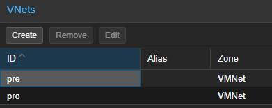
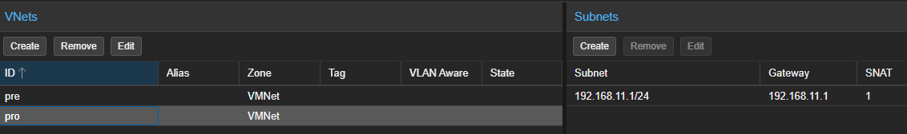

# 🧩 Configuración de SDN en Proxmox

Configurando una red **SDN (Software Defined Networking)** en Proxmox para separar entornos de **preproducción** y **producción**, manteniendo aislamiento y control mediante NAT y DHCP.

---

## 🏗️ Arquitectura

Mi ides es sencilla, lo que me interesa es tener dos redes con dhcp separadas. 
En PRO crearé recursos que serán expuestos a través de cloudflare.
La red de PRE será para pruebas y recursos que no tienen que encenderse en el arranque.

- 🔹 Una **Zone SDN** común llamada `VMNets`
- 🔹 Dos redes virtuales (VNET):
  - `PRE` → entorno de pruebas
  - `PRO` → entorno productivo
- 🔹 Cada VNET con:
  - Su propia **subnet**
  - **SNAT** para salida a internet
  - **DHCP** para asignación automática de IPs


---

## 🌐 Creación de la Zone

Primero he creado una **Zone simple** en Proxmox:

- Nombre: `VMNets`
- Tipo: `Simple`

Esta zona actúa como contenedor lógico para las redes virtuales que vamos a definir.

📸 **Configuración de la Zone:**



---

## 🔀 Creación de VNETs

A continuación, he definido dos redes virtuales dentro de la zona:

### 🧪 VNET: PRE

- Uso: entorno de pruebas
- Aislado del entorno productivo

### 🚀 VNET: PRO

- Uso: máquinas accesibles o servicios productivos
- Separado completamente de PRE

📸 **Vista de las VNETs:**



---

## 🧮 Configuración de Subnets

Cada VNET tiene su propia subnet configurada con:

### 🔧 Parámetros clave

- 📍 **Subnet CIDR** (ej: `192.168.100.0/24`)
- 🌍 **Gateway**
- 🔁 **SNAT activado**
- 📡 **DHCP range**

### Ejemplo:

#### PRE
```bash
Subnet: 192.168.100.0/24
Gateway: 192.168.100.1
DHCP Range: 192.168.100.50 - 192.168.100.200
SNAT: Enabled